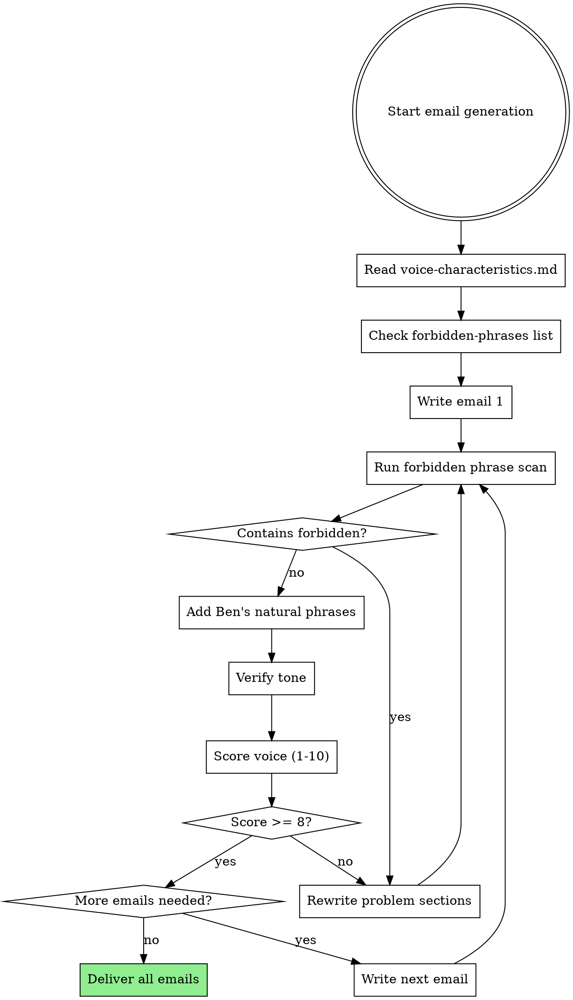

# Email Campaign Generation - The Coach Consultant

## Overview

Generate email campaigns that sound EXACTLY like Ben Hawksworth speaks and writes, using data-driven subject lines from 471 emails analyzed (353 unique subjects, 23 months of performance data).

**Core Principle:** Voice accuracy and performance optimization are NOT optional, even under time pressure.

## When to Use

Use this skill when:
- Writing ANY email content for The Coach Consultant
- Under time pressure and tempted to skip voice verification
- Generating subject lines (MUST use proven patterns from 471 emails)
- Creating nurture sequences, sales campaigns, or newsletters
- User says "make it sound like Ben" or "quick email needed"

**Symptoms you need this:**
- About to use "Here's the thing" or "Let's dive in"
- Writing "going to" instead of "gonna"
- Using corporate phrases like "move the needle"
- Not referencing 471 emails of performance data
- Feeling confident without verification

## RED FLAGS - STOP Immediately

- ❌ "Ready to send" (did you verify?)
- ❌ "Zero AI phrases" (did you check the list?)
- ❌ "Matches Ben's voice" (did you prove it?)
- ❌ "Good enough for now" (time pressure ≠ skip quality)
- ❌ Making up subject lines (use proven patterns!)

**All of these mean: Stop. Run the verification checklist below.**

## The Iron Law

**NO EMAIL WITHOUT VOICE VERIFICATION**

Time pressure does NOT excuse skipping quality checks.
"Quick" does NOT mean "skip the forbidden phrase check".
"They trust me" does NOT mean "I can wing the voice".

## Quick Reference - Email Structure

| Element | Requirement | Example |
|---------|-------------|---------|
| Opening | Hi {{first_name}}, | Hi Alex, |
| Line breaks | One sentence per line | No long paragraphs |
| Length | 20-30 lines minimum | Count before sending |
| British English | See UK spelling guide below | organisation, whilst, systematise |
| Audience | coaches, consultants and service providers | All three, always |
| CTA | Soft (CHAT, CONNECT, START) | Reply READY |
| Sign off | Ben www.thecoachconsultant.uk | No "Best," or "Cheers," |
| Subject | CampaignName \| Headline | Free Consult \| What happens next |

### UK Spelling Guide (British English Required)

| US Spelling | UK Spelling | Notes |
|-------------|-------------|-------|
| organization | organisation | -ize → -ise |
| behavior | behaviour | Add 'u' |
| optimize | optimise | -ize → -ise |
| summarize | summarise | -ize → -ise |
| systemize | systematise | -ize → -ise |
| while | whilst | More formal UK |
| among | amongst | More formal UK |
| toward | towards | Add 's' |
| analyze | analyse | -yze → -yse |
| recognize | recognise | -ize → -ise |

## Core Pattern: Voice Verification Workflow

**IMPORTANT:** Verify EACH EMAIL individually. Do not write all emails then verify at end.

**Why verify per email:** Catches issues early, prevents batch rewriting, maintains quality standards throughout.

## Step 1: Voice Verification (MANDATORY)

### BEFORE Writing ANY Email

**Read these files:**
1. `docs/deep-dive/voice-samples/voice-characteristics.md` (quick reference)
2. `docs/Ben-Claude-Projects-Instructions.txt` (email rules, lines 291-461)

**Scan for:**
- Forbidden AI phrases (list below)
- Ben's natural phrases (must use 3-5 per email)
- British English patterns
- Yorkshire straight-talk examples

### Forbidden Phrases (NEVER USE)

❌ **Generic AI openers:**
- "Here's the thing" / "Here's the reality" / "Here's how"
- "Let's dive in"
- "In this comprehensive guide"
- "It's important to note"
- "At the end of the day"
- "In conclusion" / "To summarise"
- "First and foremost"

❌ **Corporate buzzwords:**
- "Game changer" / "Unlock" / "Leverage" / "Journey"
- "Move the needle"
- "Circle back"
- "Touch base"
- "Value-add"
- "Synergy"
- "slip through the cracks"

❌ **Formal constructions:**
- "I hope this email finds you well"
- "I wanted to reach out"
- "I would like to"
- "Please find attached"

⚠️ **Borderline phrases (use sparingly, max 1x per email):**
- "Quick one" (filler, but acceptable if followed by substance)
- "Just wanted to" (passive, prefer direct statement)

### Ben's Natural Phrases (USE THESE)

✅ **Required in every email (3-5 phrases):**
- "Right so" (to start explanations)
- "gonna" (not "going to")
- "kinda"
- "From that point"
- "I see this constantly" / "I see this all the time"
- "Sound familiar"
- "The shift is simple"
- "The problem is"
- "What actually works"
- "That's how you"
- "Remember"
- "The thing is"

### Voice Scoring Checklist

Score each email 1-10:

| Criterion | Score 1-2 | Score 8-10 |
|-----------|-----------|------------|
| **Forbidden phrases** | 3+ violations | Zero violations |
| **Ben's phrases** | 0-1 used | 3-5 used naturally |
| **Contractions** | going to, kind of | gonna, kinda |
| **Directness** | Corporate/polite | Yorkshire blunt |
| **Authority** | "I think", "maybe" | "This is", "You need" |

**Minimum score to deliver: 8/10**

Below 8? Rewrite the weak sections.

## Step 2: Data-Driven Subject Lines

### NEVER Make Up Subject Lines

You have **471 emails analyzed** with **353 unique subjects**.

**Proven patterns from real data:**

| Pattern | Sends | Open Rate | Use When |
|---------|-------|-----------|----------|
| "Your guide is inside" | 13x | Unknown* | Lead magnet delivery |
| #theGAPyoumiss series | 16x | Unknown* | Educational positioning |
| BadBizAdvice series | 23x | Unknown* | Contrarian thought leadership |
| Workshop/Event titles | 15x | Unknown* | Webinar/event promotion |
| Personal/Story hooks | 20+ | Unknown* | Authenticity content |

*Open rates not available via API - use send frequency as proxy for effectiveness

### Subject Line Framework

**Format:** `CampaignName | Headline`

**Examples from real data:**
- ✅ `Free Consult | The pattern I see constantly`
- ✅ `Email Nurture | #theGAPyoumiss | "AI will figure it out for me"`
- ✅ `Weekly Newsletter | BadBizAdvice | "Only post top of funnel content"`
- ✅ `Workshop Invite | 5 Business Strategies In The AI Era`

**Psychology triggers (from Ben's proven subjects):**
- Contrarian: "Why everyone's wrong about..."
- Pattern recognition: "The pattern I see constantly"
- Gap identification: "#theGAPyoumiss"
- Bad advice calls-out: "BadBizAdvice"
- Personal story: "Eighteen months ago everything changed"
- Urgency: "Last chance", "24 hours to go"

### Subject Line Generation Process

1. **Check campaign type:**
   - Lead magnet → Use "Your guide is inside" pattern
   - Educational → **Prioritize #theGAPyoumiss or BadBizAdvice** (23-16 sends = proven)
   - Event → Use workshop/webinar format
   - Newsletter → Use weekly newsletter + topic
   - Sales/Launch → Use contrarian hooks or urgency

2. **Reference actual subjects from 353 analyzed:**
   - Search `4-emails/ghl-data/COMPLETE_EMAIL_STATISTICS.md`
   - Find similar campaign type
   - Adapt proven pattern

3. **When to use contrarian patterns:**
   - **#theGAPyoumiss** (16 sends): When addressing common blind spots or misconceptions
     - Format: `#theGAPyoumiss | "[Wrong assumption in quotes]"`
     - Example: `#theGAPyoumiss | "AI will just figure it out for me"`
   - **BadBizAdvice** (23 sends): When challenging industry norms or calling out bad practices
     - Format: `BadBizAdvice | "[Bad advice people follow]"`
     - Example: `BadBizAdvice | "Only post top of funnel content selling scares people"`

4. **Test variations:**
   - Create 3 options (at least 1 contrarian if educational content)
   - Score each for: curiosity, specificity, Ben's voice
   - Pick highest scorer

## Step 3: Campaign-Specific Guidelines

### A) Free Consult Call Claim Nurture (4-5 emails)

**Recipients:** People who just booked free consult
**Goal:** Get them excited, reduce no-shows, prep for call

**Email sequence:**
1. **Confirmation + Expectation** (Day 0)
   - Subject: "CampaignName | What happens next"
   - Content: Confirm booking, set expectations, ask them to prepare
   - CTA: Think about their biggest block

2. **Pattern Recognition** (Day 1-2)
   - Subject: "CampaignName | The pattern I see constantly"
   - Content: Describe common problem they likely have
   - CTA: Reply if this sounds familiar

3. **Pre-Call Prep** (Day before)
   - Subject: "CampaignName | Before we speak tomorrow"
   - Content: What to have ready, what to expect
   - CTA: Show up prepared

4. **2-Hour Reminder** (Day of)
   - Subject: "CampaignName | We're speaking in 2 hours"
   - Content: Zoom link, last-minute prep
   - CTA: See you soon

### B) No Show Nurture (2-3 emails)

**Recipients:** Missed their call
**Goal:** Re-book without being pushy

**Email sequence:**
1. **We Missed You** (Immediate)
   - Subject: "CampaignName | We missed you today"
   - Content: Light touch, no guilt trip, re-book option
   - CTA: Click to reschedule

2. **Value Drop** (2 days later)
   - Subject: "CampaignName | This is what we would've covered"
   - Content: Quick win they can apply now
   - CTA: Want the full breakdown? Book again

3. **Last Chance** (5 days later, optional)
   - Subject: "CampaignName | Final chance to get clarity"
   - Content: Direct, honest about moving on
   - CTA: BOOK or PASS

### C) Not Yet Ready (5-7 emails, weekly)

**Recipients:** Leads not ready to book
**Goal:** Stay top of mind, provide value, nurture to ready

**Email themes (rotate):**
1. Client success story (authority)
2. Free resource/guide (value)
3. Contrarian take (positioning)
4. Case study (proof)
5. Direct offer (ask)
6. Re-engagement check (qualify)
7. Final soft pitch (close or release)

### D) Booking Requested Reply (1-2 emails)

**Recipients:** Just submitted booking request
**Goal:** Instant confirmation, reduce drop-off

**Email:**
- Subject: "CampaignName | Got your request"
- Content: Confirm received, calendar link, what's next
- CTA: Book your slot now

### E) Appointment Reminders (2-3 emails)

**Recipients:** Have booked call
**Goal:** Reduce no-shows

**Sequence:**
1. 48-hour: Prep guide
2. 24-hour: Zoom link + agenda
3. 2-hour: Final reminder

## Step 4: Performance Optimization

### Email Elements to Optimize

**Opening line:**
- ❌ Generic: "Hope you're well"
- ✅ Direct: "Your call is locked in"

**Hook (first 3 lines):**
- Must answer: "Why should I keep reading?"
- Use pattern recognition or curiosity gap
- Example: "Most coaches who book these calls come in with vague goals"

**Body structure:**
- Short sentences
- One idea per line
- White space matters
- Break at natural thought transitions

**CTA placement:**
- Soft CTAs: Throughout (reply with thoughts)
- Hard CTAs: End of email (book, download, register)
- Never more than 2 CTAs per email

### Testing & Iteration

**A/B test these elements:**
1. Subject lines (3 variations)
2. Opening hook (direct vs story)
3. CTA copy (READY vs CHAT vs START)
4. Email length (20 vs 30+ lines)

**Track these metrics (when dashboard access available):**
- Open rate (target: 30-40% for coaching)
- Click rate (target: 5-10%)
- Reply rate (target: 3-5%)
- Booking conversion (target: 15-20%)

## Common Mistakes

### Mistake 1: "I Know Ben's Voice"

**Wrong:** Writing from memory, skipping voice verification

**Right:** ALWAYS read voice-characteristics.md first, ALWAYS check forbidden phrases

**Why it matters:** Baseline test showed 8+ AI phrase violations even when agent "knew" the voice

### Mistake 2: Generic Subject Lines

**Wrong:** Making up headlines that "sound good"

**Right:** Reference 353 actual subjects, use proven patterns

**Why it matters:** You have 23 months of data - use it!

### Mistake 3: Weak or Missing CTAs

**Wrong:** Ending with "let me know if you have questions"

**Right:** Specific ask (Reply READY, Click to book, Tell me about X)

**Why it matters:** Engagement drives performance

### Mistake 4: "Good Enough" Under Pressure

**Wrong:** "User needs it fast, I'll skip voice check"

**Right:** Follow the workflow even under time pressure

**Why it matters:** Bad emails damage Ben's brand

### Mistake 5: Not Using Ben's Data

**Wrong:** Writing "from scratch" without checking existing emails

**Right:** Reference COMPLETE_EMAIL_STATISTICS.md, use proven patterns

**Why it matters:** 471 emails analyzed = goldmine of what works

## Rationalization Table

| Excuse | Reality |
|--------|---------|
| "I already know Ben's voice" | Baseline test showed 8+ violations. Check anyway. |
| "Subject line sounds good to me" | You're not the audience. Use proven patterns from data. |
| "They need it fast, no time to verify" | Bad email wastes more time than verification takes. |
| "This is just a quick email" | Every email represents Ben's brand. No shortcuts. |
| "I'll check voice after writing" | Checking after = rewriting. Check BEFORE writing. |
| "Voice is subjective, close enough" | Voice scoring checklist is objective. Use it. |
| "I can feel when it sounds like Ben" | Feelings ≠ accuracy. Run the forbidden phrase scan. |

## Real-World Impact

**Without this skill (baseline test):**
- 8+ forbidden AI phrases used
- Generic subject lines invented
- 4.7/10 voice accuracy score
- No reference to 471 emails of data
- Agent confident but output flawed

**With this skill (expected):**
- Zero forbidden phrases
- Data-driven subject lines
- 8+/10 voice accuracy
- Performance optimized
- Verified quality

**Time investment:**
- Voice verification: 3-5 minutes
- Subject line research: 2-3 minutes
- Total overhead: 5-8 minutes per email

**Return:**
- Brand consistency maintained
- Performance optimized
- No rewrites needed
- Ben's trust preserved

## Files Reference

**Voice guidance:**
- `docs/deep-dive/voice-samples/voice-characteristics.md` (quick reference)
- `docs/Ben-Claude-Projects-Instructions.txt` (lines 291-461 for email rules)
- `docs/deep-dive/voice-samples/youtube-scripts-FULL.md` (deep context)

**Performance data:**
- `4-emails/ghl-data/COMPLETE_EMAIL_STATISTICS.md` (471 emails analyzed)
- `4-emails/ghl-data/REAL_EMAIL_DATA.md` (current campaigns)

**Brand context:**
- `/Users/learnai/Desktop/The Coach Consultant/CLAUDE.md` (overall guidelines)

## Quality Checklist (Before Delivery)

Run this checklist for EVERY email:

- [ ] Read voice-characteristics.md
- [ ] Checked forbidden phrases list (zero violations)
- [ ] Used 3-5 of Ben's natural phrases
- [ ] Subject line from proven patterns (not invented)
- [ ] Structure: Hi {{first_name}}, one sentence per line, 20-30+ lines
- [ ] British English (organisation not organization)
- [ ] Target audience: coaches, consultants and service providers
- [ ] CTA present and specific
- [ ] Sign off: Ben + www.thecoachconsultant.uk
- [ ] Voice score 8+/10
- [ ] NO "ready to send" confidence without verification

**All boxes checked? Now it's ready to send.**

## The Bottom Line

**Voice accuracy and performance optimization are NOT negotiable.**

Time pressure does NOT excuse shortcuts.
"Good enough" does NOT exist for brand voice.
Every email must score 8+/10 before delivery.

You have 471 emails of data and clear voice guidelines.
Use them. Every single time.
